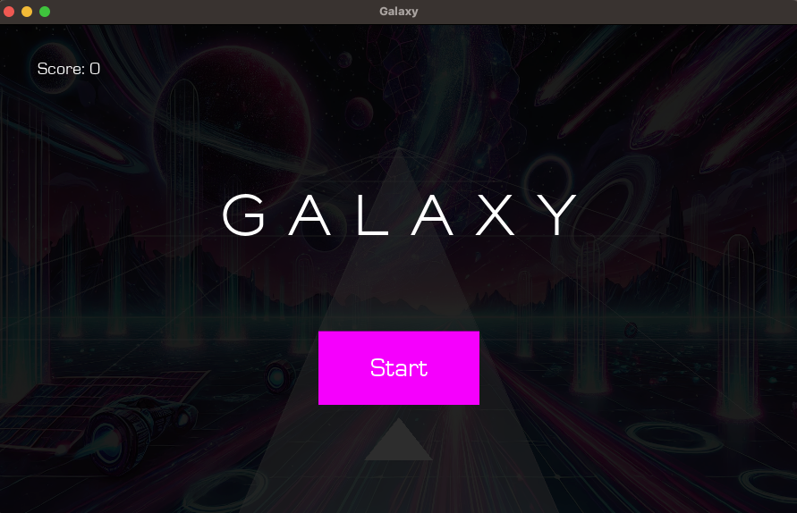
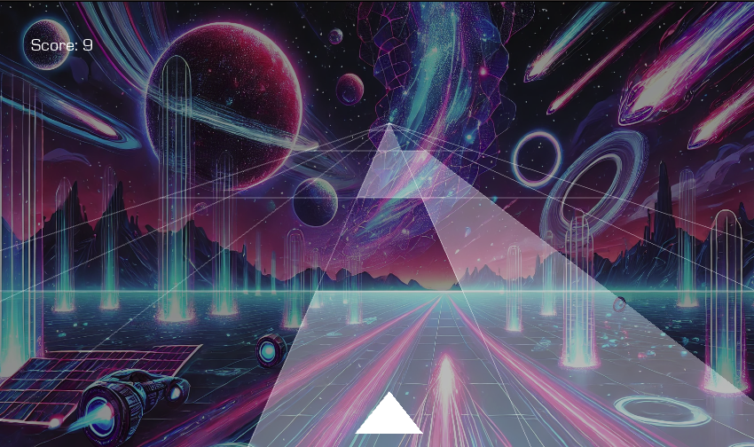

# 🌌 Galaxy Pulse


## 🚀 Overview

**Galaxy Pulse** is an exciting 2D arcade-style space game where players navigate through procedurally generated
terrains, avoid obstacles, and gather points. The game offers a unique depth effect thanks to perspective-based
rendering, creating an immersive experience for both desktop and mobile players.

Version 1.0.0 focuses on foundational gameplay mechanics such as player control, terrain generation, and scoring. The
upcoming Version 2.0.0 will introduce new features and support for additional platforms, offering a richer and more
dynamic experience.

## 🎮 Gameplay

In **Galaxy Pulse**, players steer a spaceship through space, dodging obstacles and earning points. The procedurally
generated environments and smooth controls provide endless replayability.



_Check out the game in action:_



## ✨ Features (Version 1.0.0)

- 2D terrain generation with perspective effects.
- Smooth player movement and obstacle detection.
- Multi-platform support (Windows, macOS, Linux, Android).
- Scoring and collision system.

## 🚀 Planned Features (Version 2.0.0)

Version 2.0.0 aims to deliver significant improvements and expand the scope of the game. Some of the key features
include:

- **New platforms** : Full support for iOS, macOS, and Android.
- **Advanced AI**: Introduction of enemy ships and more intelligent obstacle placement.
- **Power-ups and abilities**: Players will be able to collect power-ups to boost their ship's performance and unlock
  new abilities.
- **Multiplayer mode**: Compete with friends in real-time through a multiplayer mode.
- **Leaderboard and achievements**: Track scores and earn achievements as you progress through different challenges.
- **Enhanced sound and animations**: Improved sound effects and smoother animations for better immersion.

## 🔧 Installation

1. Prerequisites:
    - Python 3.12+
    - Kivy 2.3.0+

2. Clone the repository:
    ```bash
    git clone https://github.com/steeve0403/GalaxyPulse.git
    cd GalaxyQuest
    ```

3. Install the dependencies:
    ```bash
    pip install -r requirements.txt
    ```

4. Run the game:
    ```bash
    python main.py
    ```

## 🛠️ Technologies

- **Kivy**: For building the UI and game mechanics.
- **Python**: Core programming language.
- **Pillow**: For image handling.
- **PyCharm**: IDE for development.

## 🚀 Future Improvements

In Version 2.0.0, we plan to fully support mobile platforms such as iOS and Android, making Galaxy Pulse accessible on a wide range of devices. This will include optimized touch controls, screen resolutions, and platform-specific features.

## 📚 Documentation

Galaxy Pulse is well-documented to help developers and contributors understand its inner workings. The documentation includes:

- **Game architecture**: Explains the overall structure of the game, including the main modules and how they interact.
- **API reference**: A detailed API reference for developers, including all functions, classes, and modules.
- **Contribution guide**: Instructions for setting up the development environment and contributing to the project.

### Generating Documentation Locally

We use **Sphinx** to generate the documentation. To build the documentation locally, follow these steps:

1. Install Sphinx and the required dependencies:
    ```bash
    pip install sphinx
    ```

2. Navigate to the `docs` folder and build the HTML documentation:
    ```bash
    make html_docs
    ```

3. The generated documentation will be available in the `_build/html` folder. Open the `index.html` file in your browser to view the documentation.

### Online Documentation

The documentation is also available online through **GitHub Pages**. You can access the latest version of the documentation [here](https://steeve0403.github.io/GalaxyPulse/).

### Keeping the Documentation Updated

It is important to keep the documentation updated alongside the code. Every new feature, module, or functionality should be reflected in the documentation. Contributors are encouraged to provide detailed docstrings in their code to ensure the documentation remains clear and useful.

## 🤝 Contributing

Contributions, issues, and feature requests are welcome!

1. Fork the repository
2. Create a branch (`git checkout -b feature/AmazingFeature`)
3. Commit your changes (`git commit -m 'Add some AmazingFeature'`)
4. Push to the branch (`git push origin feature/AmazingFeature`)
5. Open a pull request

## 📄 License

This project is licensed under the MIT License - see the [LICENSE](LICENSE) file for details.
